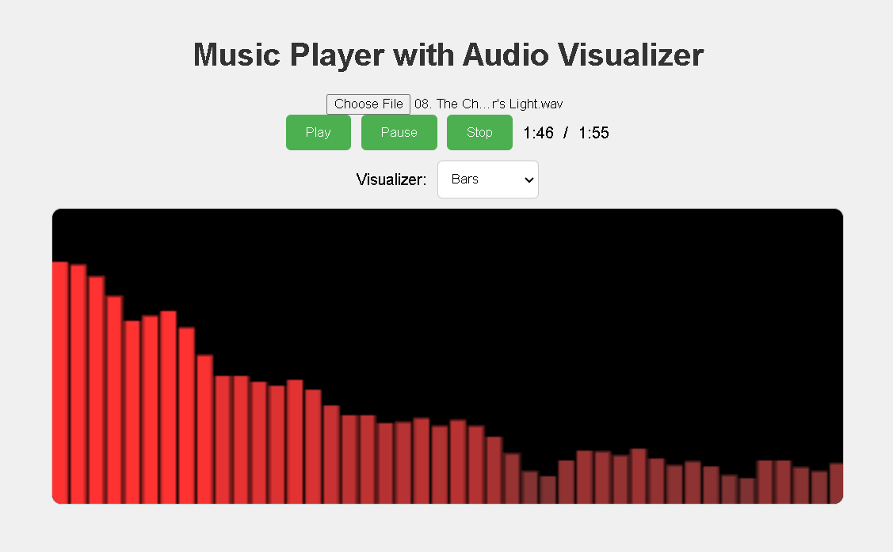

# Music Player with Audio Visualizer

This project is a fully functional music player with an integrated audio visualizer. It allows users to play, pause, and stop audio files while displaying animated visualizations that react to the audio being played. The visualizer offers multiple visualization types, such as bar charts and waveforms.



## Features

- **Audio Upload**: Users can upload their own audio files to be played.
- **Music Player Controls**: Includes play, pause, and stop functionality. Displays the current time and duration of the audio track.
- **Audio Visualizer**: Displays animated graphics that react to the audio. Users can switch between different visualization types (bars and waveform).

## Getting Started

To get a local copy up and running, follow these simple steps.

### Prerequisites

You need a modern web browser to view the project. No additional software is required.

### Installation

1. Clone the repo
   ```sh
   git clone https://github.com/YZvirblis/music-player-visualizer.git
   ```
2. Open `index.html` in your browser

## Usage

- **Upload an Audio File**: Click on the "Choose a file" button to upload an audio file.
- **Play Audio**: Click the "Play" button to start playing the audio.
- **Pause Audio**: Click the "Pause" button to pause the audio.
- **Stop Audio**: Click the "Stop" button to stop the audio.
- **Select Visualizer Type**: Use the dropdown menu to switch between bar chart and waveform visualizations.

## Acknowledgements

- [MDN Web Docs](https://developer.mozilla.org/en-US/docs/Web/API/Canvas_API) - For detailed documentation on the Canvas API.
- [Web Audio API](https://developer.mozilla.org/en-US/docs/Web/API/Web_Audio_API) - For detailed documentation on the Web Audio API.
- [Stack Overflow](https://stackoverflow.com) - For the numerous answers that helped in troubleshooting and enhancing the project.

## Contact

Yuriy Zhvirblis - [LinkedIn](https://www.linkedin.com/in/yuriy-zvirblis/) - [Email](mailto:yuriyzdev@hotmail.com)

Project Link: [https://github.com/YZvirblis/music-player-visualizer](https://github.com/YZvirblis/music-player-visualizer)
